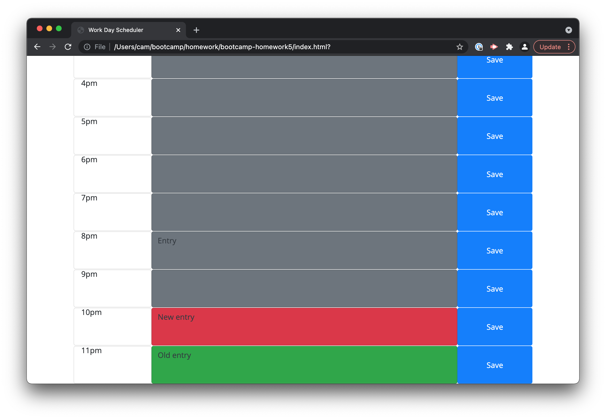

# bootcamp-homework5
Simple calendar

This application allows a user to view their calendar, and make modifications to their schedule in the time blocks listed. It saves information to local storage so that a user's data is accessible again when they reload the application.

The application can be found [here](https://caaam.github.io/bootcamp-homework5/).